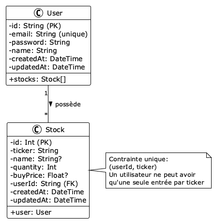
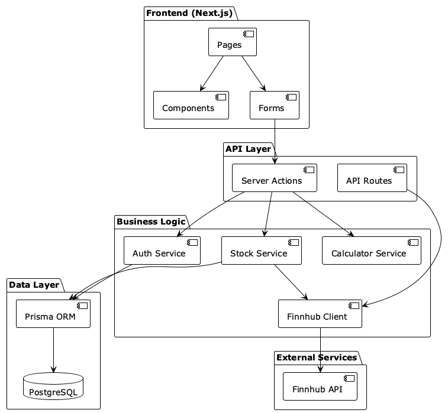
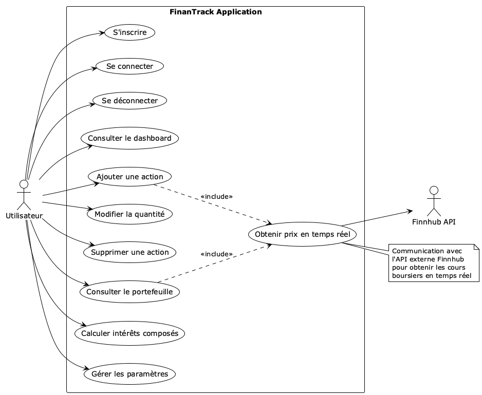
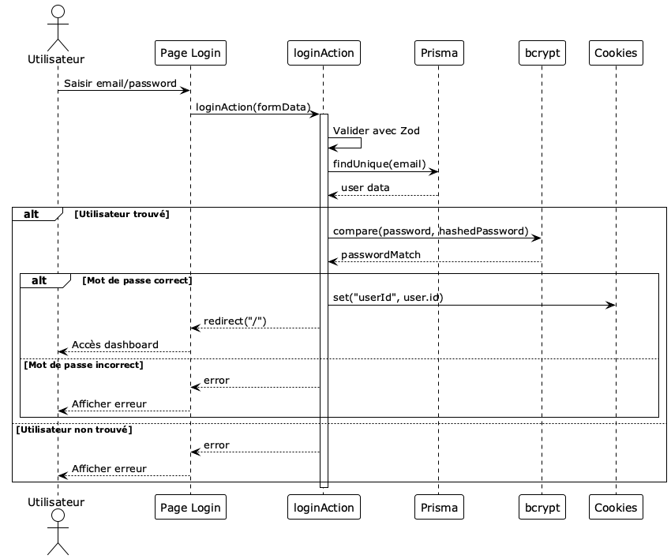
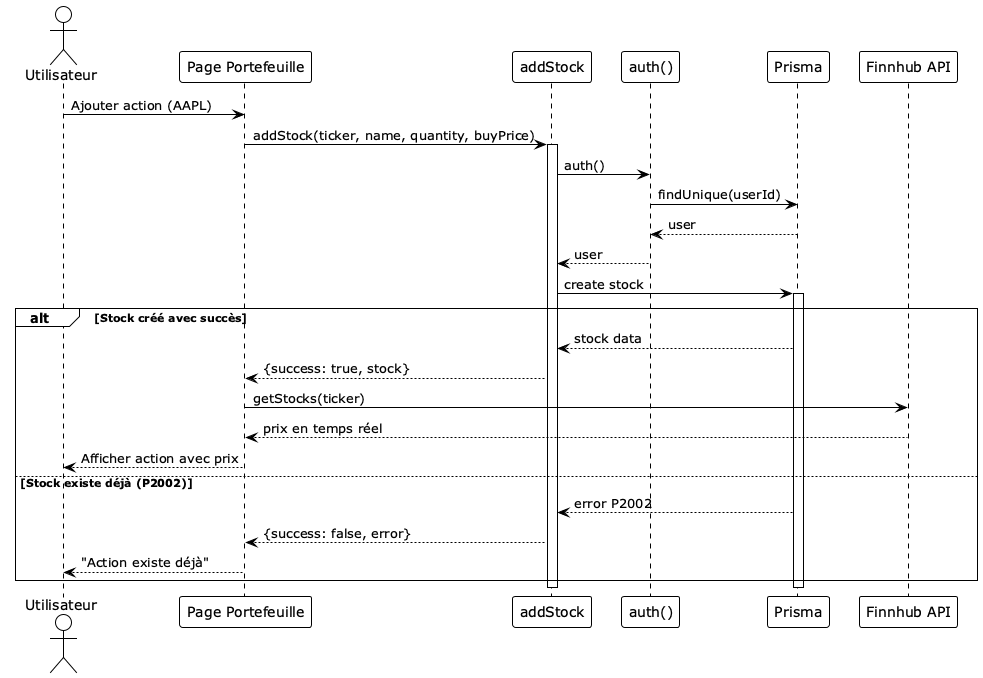
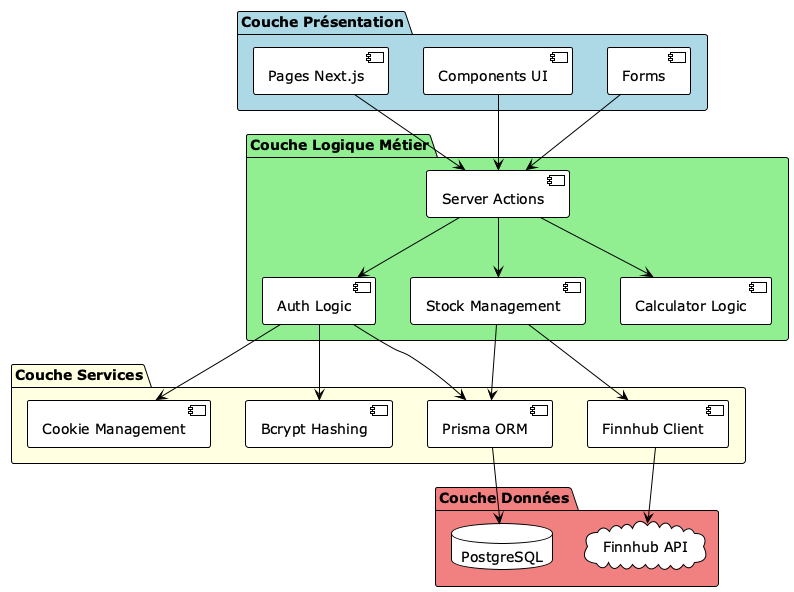
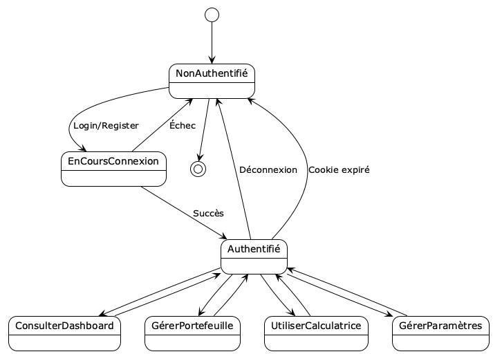

# Documentation UML - FinanTrack

## Vue d'ensemble

FinanTrack est une application de gestion de portefeuille financier développée avec Next.js 15, permettant aux utilisateurs de suivre leurs investissements boursiers en temps réel.

---

## 1. Diagramme de Classes

Ce diagramme montre le modèle de données de l'application avec les entités principales et leurs relations.



### Entités principales:
- **User**: Représente un utilisateur de l'application
  - Authentification par email/mot de passe
  - Relation 1-N avec Stock
  
- **Stock**: Représente une action en portefeuille
  - Contrainte unique sur (userId, ticker)
  - Un utilisateur ne peut avoir qu'une seule entrée par ticker

---

## 2. Diagramme de Composants

Architecture globale de l'application montrant les différentes couches et leurs interactions.



### Composants:
- **Frontend**: Pages, Components, Forms (Next.js/React)
- **API Layer**: Server Actions et API Routes
- **Business Logic**: Services métier (Auth, Stock, Calculator, Finnhub)
- **Data Layer**: Prisma ORM et PostgreSQL
- **External Services**: API Finnhub pour les données boursières

---

## 3. Diagramme de Cas d'Utilisation

Fonctionnalités disponibles pour les utilisateurs et interactions avec les services externes.



### Cas d'utilisation principaux:
1. **Authentification**: Inscription, Connexion, Déconnexion
2. **Dashboard**: Consultation des résumés et statistiques
3. **Portefeuille**: Ajout, modification, suppression d'actions
4. **Calculatrice**: Calcul d'intérêts composés
5. **Paramètres**: Gestion du compte utilisateur
6. **API externe**: Récupération des prix en temps réel (Finnhub)

---

## 4. Diagramme de Séquence - Authentification

Processus détaillé de connexion d'un utilisateur avec validation et gestion des erreurs.



### Flux d'authentification:
1. L'utilisateur saisit ses identifiants
2. Validation des données avec Zod
3. Vérification de l'existence de l'utilisateur en base
4. Comparaison du mot de passe avec bcrypt
5. Création d'un cookie de session
6. Redirection vers le dashboard

---

## 5. Diagramme de Séquence - Gestion du Portefeuille

Processus d'ajout d'une action au portefeuille avec récupération des prix en temps réel.



### Flux d'ajout d'action:
1. L'utilisateur saisit les informations de l'action (ticker, quantité, prix)
2. Vérification de l'authentification
3. Création de l'entrée en base de données
4. Gestion des erreurs (action déjà existante)
5. Récupération du prix actuel via Finnhub API
6. Affichage de l'action avec les données en temps réel

---

## 6. Architecture en Couches

Organisation de l'application en 4 couches distinctes suivant les principes d'architecture logicielle.



### Les 4 couches:

1. **Couche Présentation** (Bleu)
   - Pages Next.js
   - Components UI (shadcn/ui)
   - Formulaires

2. **Couche Logique Métier** (Vert)
   - Server Actions
   - Logique d'authentification
   - Gestion du portefeuille
   - Logique de calcul

3. **Couche Services** (Jaune)
   - Client Finnhub
   - Prisma ORM
   - Gestion des cookies
   - Hash des mots de passe (bcrypt)

4. **Couche Données** (Corail)
   - Base de données PostgreSQL
   - API externe Finnhub

---

## 7. Diagramme d'États - Session Utilisateur

États possibles d'une session utilisateur et transitions entre ces états.



### États de la session:
- **Non Authentifié**: État initial
- **En Cours de Connexion**: Phase de validation des credentials
- **Authentifié**: Accès complet aux fonctionnalités
  - Consulter Dashboard
  - Gérer Portefeuille
  - Utiliser Calculatrice
  - Gérer Paramètres

### Transitions:
- Login/Register → Authentifié (succès)
- Login/Register → Non Authentifié (échec)
- Déconnexion ou Cookie expiré → Non Authentifié

---

## Stack Technique

### Frontend
- **Framework**: Next.js 15 (App Router)
- **UI**: React 18, TailwindCSS
- **Components**: shadcn/ui
- **Validation**: Zod

### Backend
- **Runtime**: Next.js Server Actions
- **Base de données**: PostgreSQL
- **ORM**: Prisma
- **Authentification**: Cookie-based session
- **Hashing**: bcrypt

### Services Externes
- **API Boursière**: Finnhub API
- **Données**: Prix en temps réel, informations sur les actions

---

## Structure des Données

### User
```typescript
{
  id: string           // CUID unique
  email: string        // Unique
  password: string     // Hashé avec bcrypt
  name: string
  createdAt: DateTime
  updatedAt: DateTime
  stocks: Stock[]
}
```

### Stock
```typescript
{
  id: number           // Auto-increment
  ticker: string       // Symbole boursier (ex: AAPL)
  name: string?        // Nom de l'entreprise
  quantity: number     // Nombre d'actions
  buyPrice: number?    // Prix d'achat
  userId: string       // FK → User
  createdAt: DateTime
  updatedAt: DateTime
}
```

---

## Fonctionnalités Principales

### 1. Authentification Sécurisée
- Inscription avec validation Zod
- Hash des mots de passe avec bcrypt (10 rounds)
- Sessions basées sur des cookies HTTP-only
- Durée de session: 7 jours

### 2. Gestion du Portefeuille
- Ajout d'actions avec ticker, quantité et prix d'achat
- Modification de la quantité
- Suppression d'actions
- Contrainte d'unicité (un utilisateur ne peut avoir qu'une entrée par ticker)

### 3. Données en Temps Réel
- Intégration de l'API Finnhub
- Récupération des prix actuels
- Affichage des variations

### 4. Calculatrice Financière
- Calcul d'intérêts composés
- Support des apports mensuels réguliers
- Affichage du capital initial, des apports totaux et des intérêts gagnés

---

## Comment Régénérer les Diagrammes

### Avec PlantUML installé localement:
```bash
# Générer tous les diagrammes en PNG
plantuml -tpng -o images docs/uml/*.puml

# Générer en SVG (meilleure qualité)
plantuml -tsvg -o images docs/uml/*.puml
```

### Avec Docker:
```bash
./docs/generate-uml.sh
```

### En ligne:
Visitez [PlantUML Online](https://www.plantuml.com/plantuml/uml/) et copiez-collez le contenu d'un fichier `.puml`

---

## Prochaines Évolutions Possibles

1. **Fonctionnalités**
   - Graphiques de performance du portefeuille
   - Alertes de prix
   - Import/export de données
   - Multi-devises

2. **Technique**
   - API REST pour applications mobiles
   - Tests unitaires et d'intégration
   - CI/CD pipeline
   - Monitoring et logging

3. **Sécurité**
   - Authentification à deux facteurs (2FA)
   - Rate limiting
   - CSRF protection
   - Audit logs

---

*Documentation générée le 17 janvier 2026*
